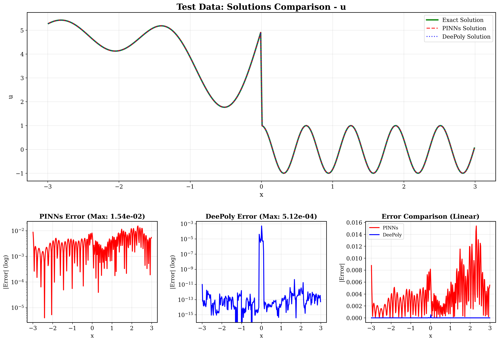

# DeePoly - High-Order Accuracy Hybrid Neural Network Framework


## Introduction

DeePoly is a universal high-precision mesh-free PDE solving framework. The core concept leverages the nonlinear approximation capabilities of deep neural networks combined with the local high-precision capabilities of traditional polynomial approximation. This novel approach significantly improves the accuracy and convergence limitations of PINN-based methods while addressing the efficiency disadvantages of non-convex optimization, achieving high-precision, high-efficiency universal equation solving capabilities. The framework aims to extend AI4S methods to complex equations and complex engineering problem solving.

## Key Features

- **Universal PDE Solver**: Applicable to all kinds of PDEs
- **Mesh-Free Approach**: Sampling points can be randomly generated with no logical relationships, suitable for complex geometries
- **High Accuracy**: Achieves high-order convergence
- **Scheme-Free**: Handles derivative relationships using automatic differentiation
- **Auto Code Generation**: Write equations into config.json with no need to change any code
- **Computational Efficiency**: Performance comparable to traditional finite difference methods
- **GPU Acceleration**: Supports CPU parallelism and GPU acceleration
- **Complex and Discontinuous Problems**: Accurately approximates discontinuous and high-gradient functions *(preliminary testing)*
- **Inverse Problems**: Solves inverse problems with higher accuracy than PINNs *(under development)*


**Research & Publications**: [ResearchGate](https://www.researchgate.net/publication/391464939_DeePoly_A_High-Order_Accuracy_and_Efficiency_Scientific_Machine_Learning_Framework) | [arXiv](https://arxiv.org/abs/2506.04613)

##  New Version Highlights

###  Enhanced Nonlinear Equation Solving

**Equation Form**:
$$\frac{\partial U}{\partial t} + L_1(U)+ L_2(U)F(U)+N(U)=0$$

**Current Time Integration**: Second-order implicit time scheme implemented in `onestep_predictor.py` (**currently the only recommended time format**).

**Performance Highlights**:
- **Allen-Cahn Equation**: Demonstrates second-order temporal accuracy and high efficiency
- **Fast Computation**: `AC_equation_100_0.1` case completes in only 10 seconds
- **Tested Applications**: Allen-Cahn, KdV, and Burgers equations successfully validated
- **Future Development**: Navier-Stokes equations and other 2D multi-equation systems in progress

**Computational Results**:


*Allen-Cahn equation solution at final time with only 100 fully random points and dt=0.1 large time step*


### Unified Codebase Maintenance & Organization
- **Unified Configuration System**: `BasePDEConfig` provides consistent `eq={L1,L2,F,N,S}` semantics across all solvers
- **Factory Pattern Architecture**: Single entry point with consistent solver selection and workflow management
- **Dimension Standardization**: Consistent tensor operations and shape management throughout the codebase

### Boundary Condition Unification
- **Unified Processing**: Consistent boundary condition specification and handling across all solver types
- **Simplified Periodic Boundaries**: Unified paired constraint implementation replacing complex multi-type systems
- ### Boundary Condition Types
Unified boundary condition processing supports:
- **Dirichlet**: `"type": "dirichlet"` with value specification
- **Neumann**: `"type": "neumann"` with normal derivative values
- **Robin**: `"type": "robin"` with mixed boundary conditions
- **Periodic**: `"type": "periodic"` with automatic pairing


### 🔧 Intelligent Code Generation & Maintenance
- **Automatic Code Generation**: `auto_spotter.py` automatically generates/updates PDE-specific code segments
- **Consistency Verification**: Signature checking and automatic regeneration of outdated code
- **Configuration-Driven**: Direct code generation from `config.json` specifications


## Quick Start

### Installation Requirements
```bash
# Core dependencies
pip install numpy scipy torch matplotlib

# Optional GPU acceleration
pip install cupy-cuda12x  # For CUDA 12.x

# Development environment
conda activate your_ml_environment
```

### Basic Usage

#### Time PDE (Allen-Cahn Equation)
```bash
python src/main_solver.py --case_path cases/Time_pde_cases/Allen_Cahn/AC_equation_100_0.1
```

#### Linear PDE (Poisson 2D)
```bash
python src/main_solver.py --case_path cases/linear_pde_cases/poisson_2d_sinpixsinpiy
```

#### Function Fitting (2D Complex Function)
```bash
python src/main_solver.py --case_path cases/func_fitting_cases/case_2d
```

## Configuration Format

### Unified Configuration System

DeePoly uses a standardized `eq={L1,L2,F,N,S}` format across all problem types:

#### Linear PDE Example (Poisson)
```json
{
  "problem_type": "linear_pde",
  "eq": {
    "L1": ["diff(u,x,2) + diff(u,y,2)"],
    "L2": ["0"],
    "F": ["0"],
    "N": ["0"],
    "S": ["-sin(pi*x)*sin(pi*y)"]
  },
  "vars_list": ["u"],
  "spatial_vars": ["x", "y"],
  "x_domain": [[0,1], [0,1]],
  "n_segments": [1, 1],
  "poly_degree": [10, 10],
  "boundary_conditions": [
    {
      "type": "dirichlet",
      "region": "left",
      "value": "1/2/(pi)**2*sin(pi*x)*sin(pi*y)",
      "points": 100
    }
  ],
  "auto_code": false
}
```

#### Time PDE Example (KdV)
```json
{
  "problem_type": "time_pde",
  "eq": {
    "L1": ["1.0*diff(u,x,3)"],     // Implicit stiff terms
    "L2": ["diff(u,x)"],           // Semi-implicit linear terms
    "F": ["u"],                    // Functions for L2⊙F coupling
    "N": []                        // Explicit nonlinear terms
  },
  "vars_list": ["u"],
  "spatial_vars": ["x"],
  "x_domain": [[-20, 20]],
  "T": 40.0,
  "dt": 0.1,
  "time_scheme": "onestep_predictor",
  "Initial_conditions": [
    {"var": "u", "value": "cos(pi*x/20)", "points": 1000}
  ],
  "boundary_conditions": [
    {"type": "periodic", "region": "left", "pair_with": "right", "points": 1}
  ],
  "auto_code": false
}
```

### Source Term and Reference Solution Support

DeePoly supports multiple formats for source terms and reference solutions:

```json
{
  "eq": {
    "S": ["sin(pi*x)*cos(pi*y)"]           // Mathematical expression
    // OR
    "S": "data_generate.py"                 // Python file reference
  },
  "reference_solution": "analytical_solution",     // Mathematical expression
  // OR
  "reference_solution": "data_generate.py",        // Python function
  // OR
  "reference_solution": "reference_data.mat"       // MATLAB data file
}
```

## Available Examples

### Linear PDE Cases
- **`poisson_2d_sinpixsinpiy`**: 2D Poisson equation with analytical solution
- **`test_file_source`**: Demonstrates source term loading from files

### Time PDE Cases

#### Allen-Cahn Equation (`Allen_Cahn/AC_equation_100_0.1`)
Allen-Cahn equation with second-order time integration - **recommended example showing fast 10-second computation**

#### Other Time PDE Examples
- **`KDV_equation`**: Korteweg-de Vries equation
- **`Burgers`**: Burgers equation

**Note**: All time PDE examples use the second-order predictor-corrector time integration scheme.

### Function Fitting Cases
- **`case_2d`**: Complex 2D multi-modal function approximation
- **`discontinuous_case1`**: Challenging discontinuous function handling


## Version History

- **v0.1 (Beta)**: Initial release with basic function approximation and PDE solving
- **v0.2**: High-accuracy linear PDE solving, auto-code generation, English documentation
- **v0.3 (Current)**: Enhanced nonlinear solving, unified system architecture, advanced time integration, comprehensive boundary condition unification

## Next Version Roadmap

- **2D Time-Dependent Nonlinear PDEs**: Complete implementation of two-dimensional time-dependent nonlinear PDE problem solving and steady-state problems
- **Pseudo-Time Stepping**: Global solving with pseudo-time stepping (removing time scheme precision limitations on solution accuracy)

## Future Development

- **Complex Boundary Conditions**: Advanced internal and external boundary conditions (leveraging mesh-free method advantages)
- **Discontinuous Problem Enhancement**: Improved accuracy for discontinuous problems and compressible fluid dynamics problem solving。

## Citation

If you use DeePoly in your research, please cite:

@article{liu2025deepoly,
  title={DeePoly: A High-Order Accuracy Scientific Machine Learning Framework for Function Approximation and Solving PDEs},
  author={Liu, Li and Yong, Heng},
  year={2025}
}


## Test Cases & Validation Results

The following test cases demonstrate DeePoly's capabilities across function approximation and PDE solving:

### Function Approximation Cases

#### 1. 1D Sine Function
**Case Directory**: `func_fitting_cases/test_sin`
**Target Function**: `f(x) = sin(2πx) + 0.5cos(4πx)`
**Problem Type**: Baseline function approximation test case

##### Results
**Training Data Analysis**


**Test Data Analysis**


##### Performance Metrics
| Component | Time Cost |
|-----------|-----------|
| **Scoper/DNN** | 7.2049 seconds |
| **Sniper** | 0.1630 seconds |
| **Total** | 7.3679 seconds |

##### Additional Information
- **Error Analysis**: Detailed metrics available in `cases/func_fitting_cases/test_sin/results/error_analysis_report.txt`
- **Configuration**: See `cases/func_fitting_cases/test_sin/config.json`

---

#### 2. Complex 2D Function
**Case Directory**: `func_fitting_cases/case_2d`
**Target Function**: `f(x,y) = Multi-Gaussian peaks + trigonometric + polynomial terms on [-3,3]²`
**Problem Type**: Complex multi-modal function approximation

##### Results
**Training Data Analysis**


**Test Data Analysis**


##### Performance Metrics
| Component | Time Cost |
|-----------|-----------|
| **Scoper/DNN** | 36.7667 seconds |
| **Sniper** | 6.2360 seconds |
| **Total** | 43.0027 seconds |

##### Additional Information
- **Error Analysis**: Detailed metrics available in `cases/func_fitting_cases/case_2d/results/error_analysis_report.txt`
- **Configuration**: See `cases/func_fitting_cases/case_2d/config.json`

---

#### 3. Discontinuous Function
**Case Directory**: `func_fitting_cases/discontinuous_case1`
**Target Function**: `f(x,y) = Near-discontinuous function with sharp transitions`
**Problem Type**: Challenging discontinuous function approximation

##### Results
**Training Data Analysis**


**Test Data Analysis**


##### Performance Metrics
| Component | Time Cost |
|-----------|-----------|
| **Scoper/DNN** | 17.8730 seconds |
| **Sniper** | 0.2645 seconds |
| **Total** | 18.1374 seconds |

##### Additional Information
- **Error Analysis**: Detailed metrics available in `cases/func_fitting_cases/discontinuous_case1/results/error_analysis_report.txt`
- **Configuration**: See `cases/func_fitting_cases/discontinuous_case1/config.json`

---

### PDE Solving Cases

#### 4. 2D Poisson Equation
**Case Directory**: `linear_pde_cases/poisson_2d_sinpixsinpiy`
**PDE Equation**: `∇²u = -sin(πx)sin(πy)` on [0,1]²
**Problem Type**: Linear elliptic PDE with analytical solution

##### Results
**Training Data Analysis**


**Test Data Analysis**


##### Performance Metrics
| Component | Time Cost |
|-----------|-----------|
| **Scoper/PINNs** | 10.2692 seconds |
| **Sniper** | 2.0110 seconds |
| **Total** | 12.2802 seconds |

##### Additional Information
- **Error Analysis**: Detailed metrics available in `cases/linear_pde_cases/poisson_2d_sinpixsinpiy/results/error_analysis_report.txt`
- **Configuration**: See `cases/linear_pde_cases/poisson_2d_sinpixsinpiy/config.json`

---

#### 5. High-Frequency Poisson
**Case Directory**: `linear_pde_cases/poisson_2d_sin4pixsin4piy`
**PDE Equation**: `∇²u = -32π²sin(4πx)sin(4πy)` on [0,1]²
**Problem Type**: High-frequency variant of Poisson equation

##### Results
**Training Data Analysis**


**Test Data Analysis**


##### Performance Metrics
| Component | Time Cost |
|-----------|-----------|
| **Scoper/PINNs** | 34.7317 seconds |
| **Sniper** | 14.3702 seconds |
| **Total** | 49.1018 seconds |

##### Additional Information
- **Error Analysis**: Detailed metrics available in `cases/linear_pde_cases/poisson_2d_sin4pixsin4piy/results/error_analysis_report.txt`
- **Configuration**: See `cases/linear_pde_cases/poisson_2d_sin4pixsin4piy/config.json`

---

#### 6. Linear Convection with Discontinuity
**Case Directory**: `linear_pde_cases/linear_convection_discontinuity`
**PDE Equation**: `du/dt + 0.3du/dx = 0` (time-dependent)
**Problem Type**: Hyperbolic PDE with discontinuous wave propagation

##### Results
**Training Data Analysis**


**Test Data Analysis**


##### Performance Metrics
| Component | Time Cost |
|-----------|-----------|
| **Scoper/PINNs** | 16.8255 seconds |
| **Sniper** | 0.6267 seconds |
| **Total** | 17.4521 seconds |

##### Additional Information
- **Error Analysis**: Detailed metrics available in `cases/linear_pde_cases/linear_convection_discontinuity/results/error_analysis_report.txt`
- **Configuration**: See `cases/linear_pde_cases/linear_convection_discontinuity/config.json`

---


## Project Structure

```
DeePoly/
├── src/                           # Core framework
│   ├── main_solver.py            # Unified entry point with factory pattern
│   ├── abstract_class/           # Unified abstractions and base classes
│   │   ├── config/               # Unified configuration system
│   │   │   ├── base_pde_config.py    # ✨ Unified PDE configuration
│   │   │   ├── base_data.py          # Unified data pipeline
│   │   │   └── base_visualize.py     # Visualization base
│   │   ├── boundary_conditions.py   # ✨ Unified boundary processing
│   │   ├── base_fitter.py           # Core fitting algorithm
│   │   ├── base_net.py              # Neural network base
│   │   └── operator_factory.py      # Operator generation
│   ├── problem_solvers/          # Domain-specific solvers
│   │   ├── linear_pde_solver/    # Linear PDE problems
│   │   ├── time_pde_solver/      # Time-dependent PDEs with IMEX
│   │   └── func_fitting_solver/  # Function approximation
│   ├── algebraic_solver/         # ✨ Enhanced nonlinear/linear algebra
│   │   ├── gauss_newton.py       # LM damping + Wolfe line search
│   │   ├── trustregionsolver.py  # Preconditioned trust region
│   │   ├── fastnewton.py         # Fast Newton methods
│   │   └── linear_solver.py      # GPU-accelerated linear solving
│   └── meta_coding/              # ✨ Automatic code generation
│       ├── auto_spotter.py       # Auto code generation
│       ├── auto_code_manager.py  # Consistency management
│       └── auto_snipper.py       # Code snippet utilities
├── cases/                        # Examples and test cases
│   ├── linear_pde_cases/         # Linear PDE examples
│   ├── Time_pde_cases/           # Time PDE examples
│   └── func_fitting_cases/       # Function fitting examples
└── Doc/                          # Comprehensive documentation
```