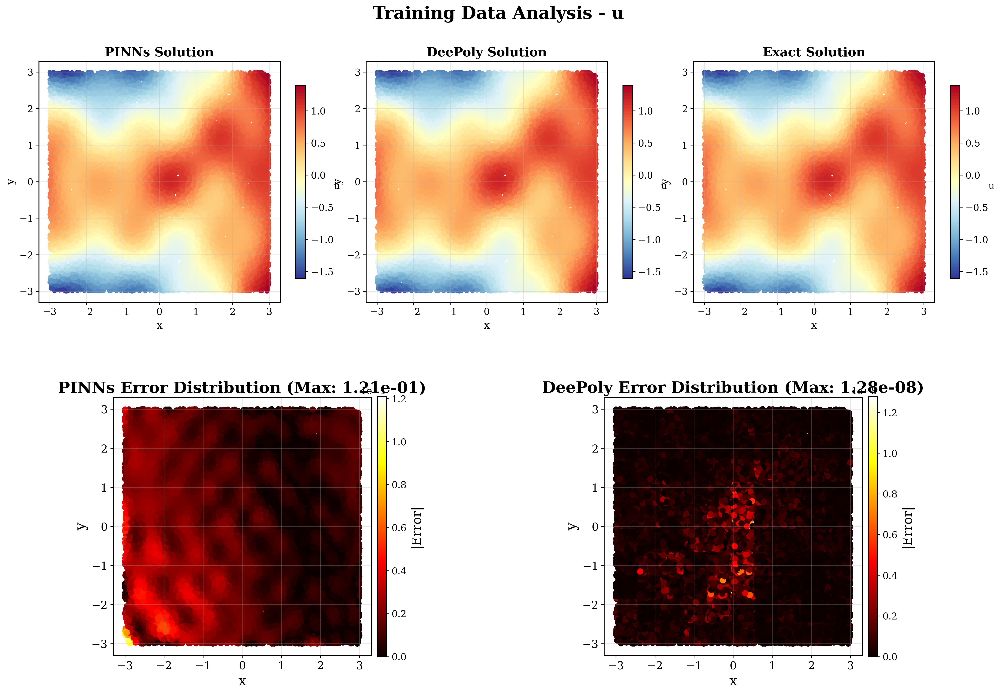
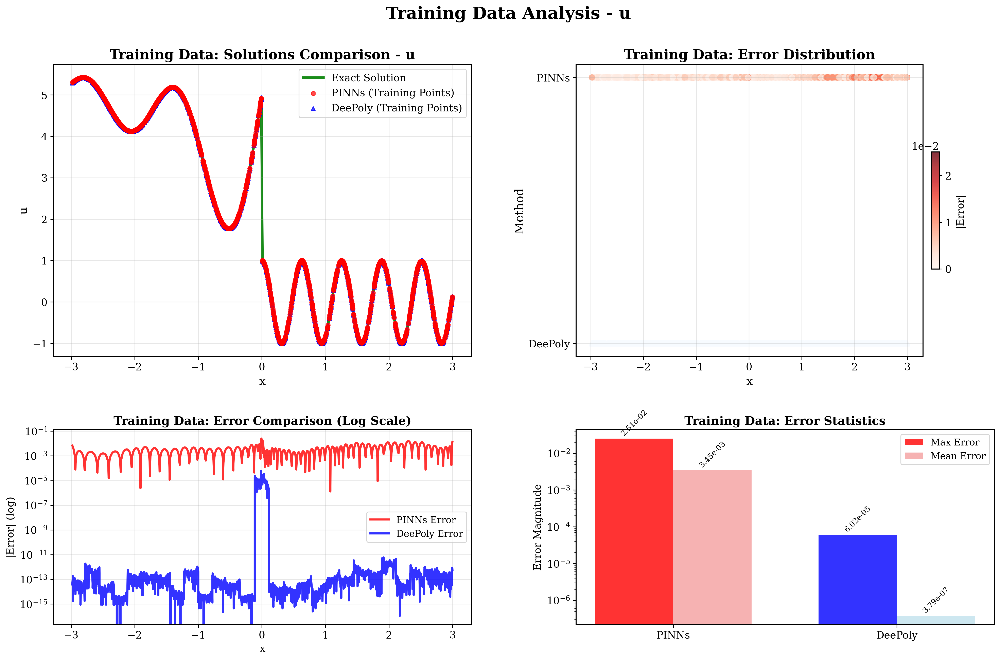
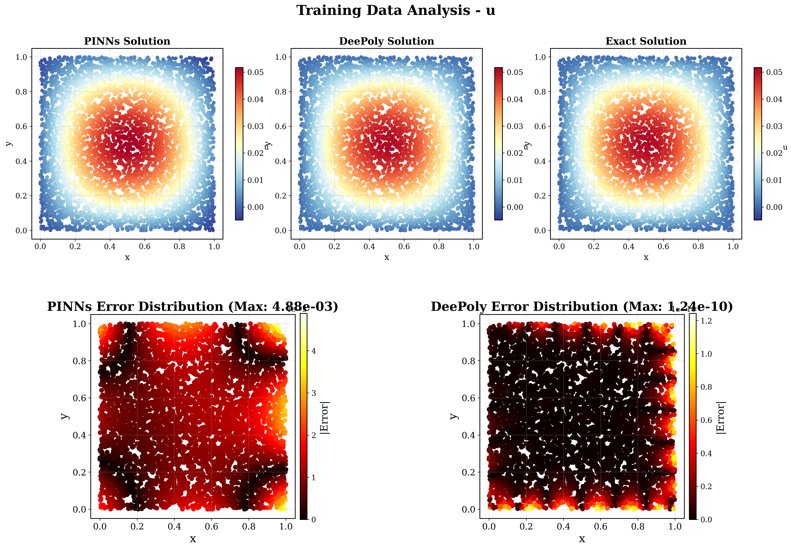
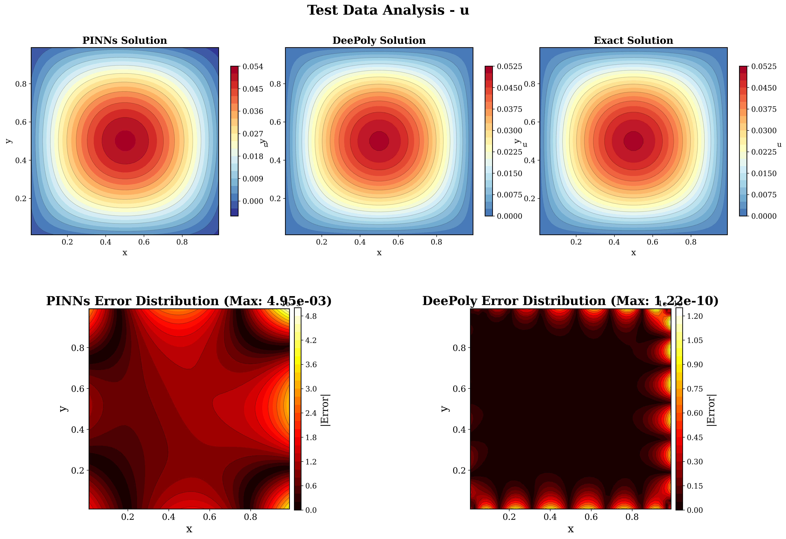

# DeePoly - High-Order Accuracy Neural Network Framework for Function Approximation and PDE Solving


## Introduction

DeePoly is a novel general-purpose platform for function approximation and equation solving algorithms. Core theorem and algorithm: [DeePoly: A High-Order Accuracy and Efficiency Scientific Machine Learning Framework](https://www.researchgate.net/publication/391464939_DeePoly_A_High-Order_Accuracy_and_Efficiency_Scientific_Machine_Learning_Framework?_tp=eyJjb250ZXh0Ijp7ImZpcnN0UGFnZSI6InByb2ZpbGUiLCJwYWdlIjoicHJvZmlsZSJ9fQ)

## Key Features

- **Universal PDE Solver**:  Fit for all kinds of PDE.
- **Mesh-Free**: Sampling points can be randomly generated with no logical relationships, suitable for complex geometries.
- **High Accuracy**: Achieves high-order convergence.
- **Scheme-Free**: Handles derivative relationships using automatic differentiation.
- **Efficient**: Computational efficiency comparable to traditional finite difference methods.
- **GPU Accelerated**: Supports CPU parallelism and GPU acceleration.
- **Applicable to Complex and Discontinuous Problems**: Accurately approximates discontinuous and high-gradient functions.
- **Suitable for Inverse Problems**: Solves inverse problems with higher accuracy than PINNs.

## Version Information

Previous version: v0.1 (Beta). The `cases` directory includes both function approximation and PDE solving test cases. The core algorithm in `src` contains all derivative computation code with comprehensive testing.

Current version: v0.2:
- High-accuracy solving for arbitrary-dimensional linear PDEs.
- Auto code of the PDE.
- English-commented version.
- Other corrections of output and visualize.

## Usage

Develop your own problems in the `cases` directory, including data generation, output, and configuration files.

```bash
# Run function fitting example
python src/main_solver.py --case_path cases/func_fitting_cases/case_2d

# Run PDE solving example  
python src/main_solver.py --case_path cases/linear_pde_cases/poisson_2d_sinpixsinpiy
# First time run, you need set auto-code=true, and then rerun it.
```

## Installation Requirements

- Python
- CUDA
- torch

## Test Cases & Results

The following test cases demonstrate DeePoly's capabilities across function approximation and PDE solving:

### Function Approximation Cases

#### 1. 1D Sine Function
**Case Directory**: `func_fitting_cases/test_sin`  
**Target Function**: `f(x) = sin(2πx) + 0.5cos(4πx)`  
**Problem Type**: Baseline function approximation test case

##### Results
**Training Data Analysis**  


**Test Data Analysis**  


##### Performance Metrics
| Component | Time Cost |
|-----------|-----------|
| **Scoper/DNN** | 7.2049 seconds |
| **Sniper** | 0.1630 seconds |
| **Total** | 7.3679 seconds |

##### Additional Information
- **Error Analysis**: Detailed metrics available in `cases/func_fitting_cases/test_sin/results/error_analysis_report.txt`
- **Configuration**: See `cases/func_fitting_cases/test_sin/config.json`

---

#### 2. Complex 2D Function
**Case Directory**: `func_fitting_cases/case_2d`  
**Target Function**: `f(x,y) = Multi-Gaussian peaks + trigonometric + polynomial terms on [-3,3]²`  
**Problem Type**: Complex multi-modal function approximation

##### Results
**Training Data Analysis**  


**Test Data Analysis**  


##### Performance Metrics
| Component | Time Cost |
|-----------|-----------|
| **Scoper/DNN** | 36.7667 seconds |
| **Sniper** | 6.2360 seconds |
| **Total** | 43.0027 seconds |

##### Additional Information
- **Error Analysis**: Detailed metrics available in `cases/func_fitting_cases/case_2d/results/error_analysis_report.txt`
- **Configuration**: See `cases/func_fitting_cases/case_2d/config.json`

---

#### 3. Discontinuous Function
**Case Directory**: `func_fitting_cases/discontinuous_case1`  
**Target Function**: `f(x,y) = Near-discontinuous function with sharp transitions`  
**Problem Type**: Challenging discontinuous function approximation

##### Results
**Training Data Analysis**  


**Test Data Analysis**  


##### Performance Metrics
| Component | Time Cost |
|-----------|-----------|
| **Scoper/DNN** | 17.8730 seconds |
| **Sniper** | 0.2645 seconds |
| **Total** | 18.1374 seconds |

##### Additional Information
- **Error Analysis**: Detailed metrics available in `cases/func_fitting_cases/discontinuous_case1/results/error_analysis_report.txt`
- **Configuration**: See `cases/func_fitting_cases/discontinuous_case1/config.json`

---

### PDE Solving Cases

#### 4. 2D Poisson Equation
**Case Directory**: `linear_pde_cases/poisson_2d_sinpixsinpiy`  
**PDE Equation**: `∇²u = -sin(πx)sin(πy)` on [0,1]²  
**Problem Type**: Linear elliptic PDE with analytical solution

##### Results
**Training Data Analysis**  


**Test Data Analysis**  


##### Performance Metrics
| Component | Time Cost |
|-----------|-----------|
| **Scoper/PINNs** | 10.2692 seconds |
| **Sniper** | 2.0110 seconds |
| **Total** | 12.2802 seconds |

##### Additional Information
- **Error Analysis**: Detailed metrics available in `cases/linear_pde_cases/poisson_2d_sinpixsinpiy/results/error_analysis_report.txt`
- **Configuration**: See `cases/linear_pde_cases/poisson_2d_sinpixsinpiy/config.json`

---

#### 5. High-Frequency Poisson
**Case Directory**: `linear_pde_cases/poisson_2d_sin4pixsin4piy`  
**PDE Equation**: `∇²u = -32π²sin(4πx)sin(4πy)` on [0,1]²  
**Problem Type**: High-frequency variant of Poisson equation

##### Results
**Training Data Analysis**  


**Test Data Analysis**  


##### Performance Metrics
| Component | Time Cost |
|-----------|-----------|
| **Scoper/PINNs** | 34.7317 seconds |
| **Sniper** | 14.3702 seconds |
| **Total** | 49.1018 seconds |

##### Additional Information
- **Error Analysis**: Detailed metrics available in `cases/linear_pde_cases/poisson_2d_sin4pixsin4piy/results/error_analysis_report.txt`
- **Configuration**: See `cases/linear_pde_cases/poisson_2d_sin4pixsin4piy/config.json`

---

#### 6. Linear Convection with Discontinuity
**Case Directory**: `linear_pde_cases/linear_convection_discontinuity`  
**PDE Equation**: `du/dt + 0.3du/dx = 0` (time-dependent)  
**Problem Type**: Hyperbolic PDE with discontinuous wave propagation

##### Results
**Training Data Analysis**  


**Test Data Analysis**  


##### Performance Metrics
| Component | Time Cost |
|-----------|-----------|
| **Scoper/PINNs** | 16.8255 seconds |
| **Sniper** | 0.6267 seconds |
| **Total** | 17.4521 seconds |

##### Additional Information
- **Error Analysis**: Detailed metrics available in `cases/linear_pde_cases/linear_convection_discontinuity/results/error_analysis_report.txt`
- **Configuration**: See `cases/linear_pde_cases/linear_convection_discontinuity/config.json`

---
